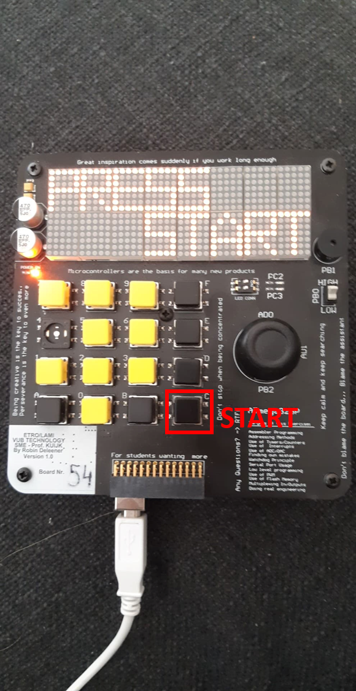
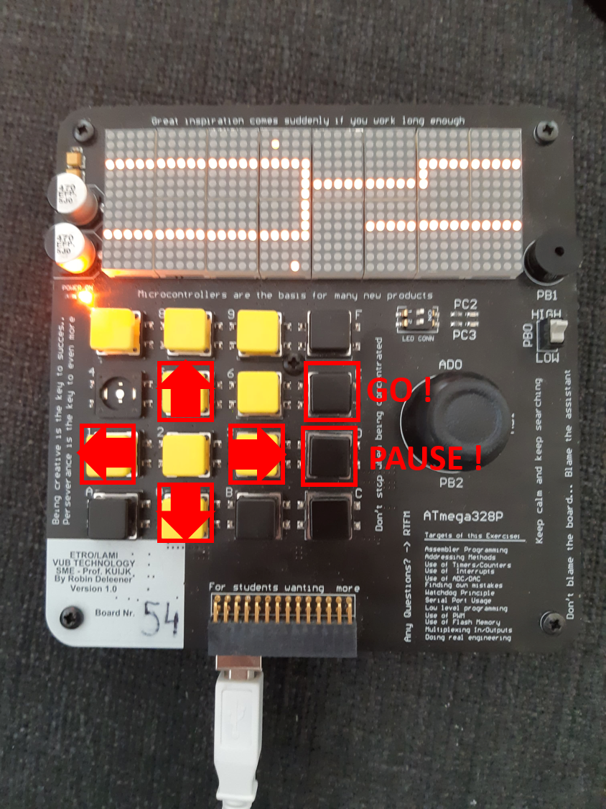
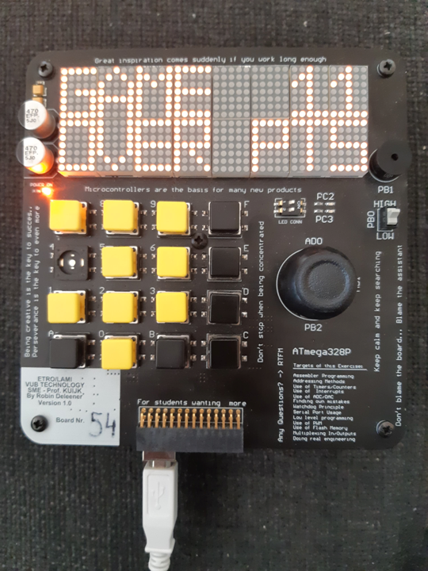

# eMAZEing_run
The goal of the game is to obtain the highest score. To do so the player controls the constantlymoving sprite by choosing its movement direction in order to get through the maze and run bya fruit and ’eat’ it. Every time when it happens the sprite accelerates making going through themaze and reaching the next fruit harder.  The game is over when the sprite hits one of maze’swalls.

# How to play :

